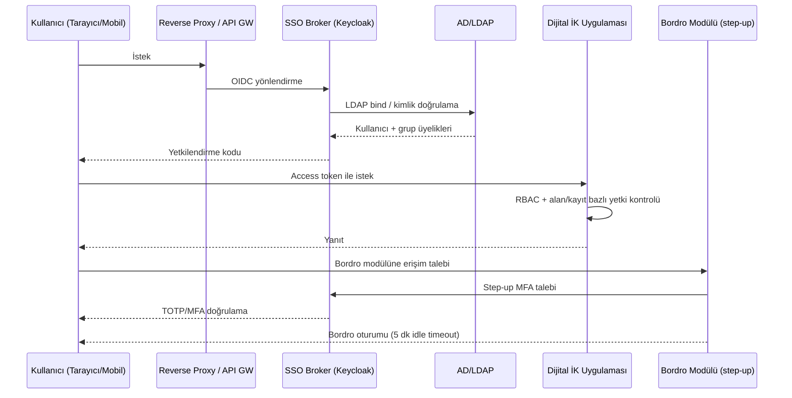
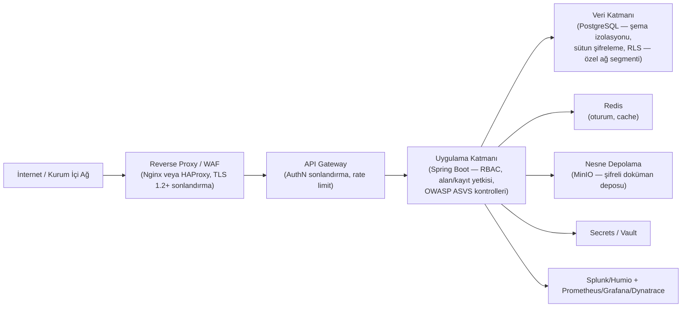
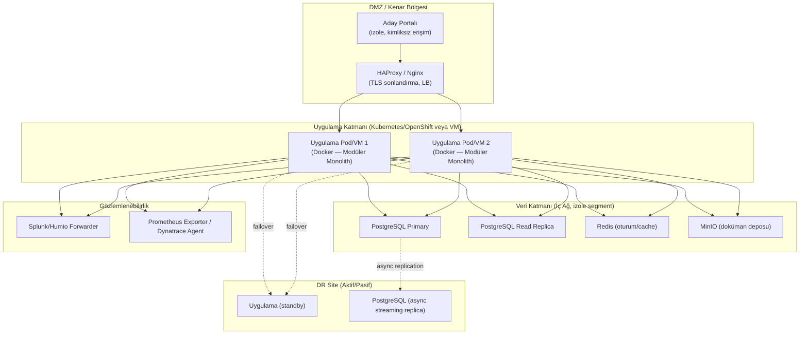

# Dijital İnsan Kaynakları Yönetim Sistemi — Çözüm Mimarisi

**Durum:** Taslak — Değerlendirme için hazırlanmıştır
**Girdi:** `Master_Requirements_Specification.md` (FR/NFR/SEC/INT/OPS/DEP/SLA kimlikleri bu doküman genelinde referans olarak kullanılmıştır)
**Kapsam:** Bu doküman bir **çözüm mimarisi**dir; uygulama kodu, sınıf diyagramı veya iskelet proje içermez. Amaç, 180 günlük (ilk 90 günü kritik 5 modülü kapsayan) sıfırdan geliştirme takvimini gerçekçi kılacak, tek yüklenici/alt yüklenicisiz bir ekip tarafından yönetilebilir, on-premise bir mimari tanımlamaktır.
**Notasyon:** Her mimari karar **alternatifler → seçilen yaklaşım → gerekçe** üçlüsüyle sunulmuştur. Gereksinim dokümanında GAP/çelişki olarak işaretlenen noktalarda (RTO/RPO, performans NFR'leri, native/PWA mobil, vb.) bu doküman **varsayılan bir mimari karar önerir** ve bunu açıkça "Varsayım — İdare ile teyit edilmeli" olarak işaretler; bu varsayımlar Bölüm 16 ve ADR listesinde tekrar toplanmıştır.

---

## 0. Mimari Hedefler ve Kısıtlar (Özet)

| Kısıt | Kaynak | Mimariye Etkisi |
|---|---|---|
| 180 takvim günü, ilk 90 günde 5 kritik modül (%56 hakediş) teslim | ST Md.9.1, TŞ Ödeme Koşulları | Paylaşılan çekirdek (Özlük/Organizasyon/Onay Motoru) ilk haftalarda dondurulmalı; modüller paralel ama ortak bir platformun üstünde geliştirilmeli |
| Tek yüklenici, alt yüklenici yasak | İŞ Md.18.1, ST Md.15.1 | Dağıtık/mikroservis mimarisinin getirdiği çoklu ekip/servis koordinasyon yükü riskli; tek, iyi modülerize edilmiş kod tabanı tercih edilir |
| On-premise, BKM veri merkezi, VMware, RHEL/Windows | DEP-001–004 | Bulut-native elastik ölçekleme varsayımları geçersiz; kapasite planlaması sabit VM/consuming önceden yapılmalı |
| 300 lisans (6 tam yetkili İK + 5 yetkili İK + genel çalışan self-servis) | FR-008 | Ölçek küçük-orta; mikroservislerin ölçeklenebilirlik avantajı bu ölçekte gerekçelendirilemez |
| Batch process yasak, işlemler senkron/anlık olmalı | FR-002/NFR-002 | Modüller arası iletişimde ağır gece batch/ETL yerine olay tabanlı/senkron çağrı tercih edilir (bkz. Bölüm 4) |
| 13 vs 14 modül belirsizliği (Doküman Yönetimi modülü) | Bölüm 17 Çelişki #1 | Mimari, 14. modülü platformun bir parçası olarak tasarlar; ödeme/kapsam belirsizliği ticari bir konudur, mimariyi etkilemez |
| RTO/RPO ve performans NFR'leri sayısal olarak verilmemiş | Bölüm 17 Çelişki #4, Risk #13 | Bu doküman somut hedef **önerir** (Bölüm 13), idare teyidine tabidir |

---

## 1. Sistem Bağlam Diyagramı

```mermaid
graph TB
    subgraph Kullanicilar["Kullanıcılar"]
        U1["Tam Yetkili İK (6)"]
        U2["Yetkili İK (5)"]
        U3["Çalışan (Self-servis)\nWeb + Mobil"]
        U4["Yönetici (N. seviye)"]
        U5["Üst Yönetim / GM"]
        U6["Direktör / İK İş Ortağı"]
        U7["Disiplin Kurulu Üyesi / Audit"]
        U8["Hizmet Sağlayıcı (Randevu)"]
        U9["Kulüp Lideri"]
        U10["Sistem Yöneticisi"]
        U11["Aday (Candidate)\nharici, kimliksiz"]
    end

    SYS["Dijital İK Yönetim Sistemi\n(Modüler Monolith — Java/Spring Boot + React/TS)"]

    subgraph Kimlik["Kimlik ve Erişim"]
        AD["Active Directory / LDAP(S)"]
        SSO["SSO / IdP (Kurumsal)"]
    end

    subgraph Zaman["Zaman ve Fiziksel Erişim"]
        PDKS["PDKS: Kartlı Geçiş / Biyometrik / Mobil Giriş"]
    end

    subgraph Mali["Bordro ve Mali Entegrasyonlar"]
        ERP["Bordro / ERP / Muhasebe Sistemleri"]
        BANK["Bankalar (Maaş Ödeme, IBAN Doğrulama)"]
        EGOV["e-Devlet / SGK (Muhtasar-Prim, İşe Giriş-Çıkış)"]
        BES["BES Firmaları"]
        SAGLIK["Özel Sağlık / Hayat Sigortası Firmaları"]
        YEMEK["Yemek Kartı Firmaları"]
    end

    subgraph Ops["İzleme, Log ve Operasyon"]
        SPLUNK["Splunk / Humio (Merkezi Log)"]
        APM["Prometheus / Grafana / Dynatrace"]
    end

    CAL["Outlook / Exchange (Takvim — Mülakat Planlama)"]

    U1 & U2 & U3 & U4 & U5 & U6 & U7 & U8 & U9 & U10 --> SYS
    U11 -. "sınırlı, harici portal" .-> SYS

    SYS <--> AD
    SYS <--> SSO
    SYS <--> PDKS
    SYS --> ERP
    SYS --> BANK
    SYS --> EGOV
    SYS --> BES
    SYS --> SAGLIK
    SYS --> YEMEK
    SYS <--> CAL
    SYS --> SPLUNK
    SYS --> APM
```

**Notlar:**
- Aday (Candidate) tek dış/kimliksiz aktördür; İşe Alım modülünün aday portalı ayrı bir güvenlik bölgesinde (bkz. Bölüm 15) yayınlanır.
- Bordro modülüne giden tüm dış entegrasyonlar (ERP, Banka, e-Devlet, BES, Sağlık, Yemek Kartı) hem en katı yetkilendirme (LDAP + zorunlu 2FA, FR-1116) hem de en yüksek veri hassasiyeti sınıfını taşır (bkz. Bölüm 14).
- PDKS entegrasyonu, Zaman Yönetimi modülünün ve gerçek zamanlı "ofiste anlık çalışan sayısı" dashboard'unun (FR-605) veri kaynağıdır.

---

## 2. Modüler Monolith Tercihinin Gerekçesi

### Değerlendirilen alternatifler

| Alternatif | Neden reddedildi / kabul edilmedi |
|---|---|
| **Mikroservis mimarisi** (her 14 modül ayrı deployable, kendi DB'si, servisler arası REST/mesajlaşma) | 180 günlük takvimde 14 ayrı servisin bağımsız CI/CD, servis keşfi, dağıtık transaction yönetimi, ayrı ayrı gözlemlenebilirlik altyapısı kurulması; tek yüklenici/alt yüklenici yasağı ile sınırlı ekip kapasitesine dağıtık sistem operasyon yükü eklenmesi riski çok yüksek (bkz. Risk #11, Master doküman). 300 kullanıcılık ölçek, mikroservisin bağımsız ölçekleme avantajını gerekçelendirmiyor. |
| **Klasik (modülerize edilmemiş) monolith** — tek büyük kod tabanı, katmanlı mimari, modüller arası serbest erişim | Sözleşme; modül bazlı **kısmi kabul ve hakediş** (ST Md.12.1, Md.20.1) öngörüyor — 90. günde 5 modülün ayrı ayrı teslim/kabul edilmesi gerekiyor. Sınır çizilmemiş bir monolith'te "modül tamamlandı" tanımı belirsizleşir, regresyon riski artar (bir modüle dokunmak, kabul edilmiş başka bir modülü bozabilir). |
| **Modüler Monolith** (gerçek Maven multi-module: her modül ayrı bir Maven modülü/jar, tek deployable'a (`app`) derlenir, net modül sınırları, modül-başına şema, iyi tanımlanmış herkese açık API) | **Seçilen yaklaşım.** |

### Gerekçe

1. **Sözleşmesel teslim modeliyle uyum:** Her modül ayrı bir "bounded context" olarak modellendiği için, 90 gün / 180 gün fazlarında modül bazlı kısmi kabul (ST Md.20.1) net sınırlarla desteklenir; bir modülün kabulünden sonra diğer modüle yapılan değişiklik, modül sınırı ihlal edilmediği sürece kabul edilmiş modülü etkilemez.
2. **Tek ekip / tek deployable, düşük operasyonel yük:** Alt yüklenici yasağı ve 180 günlük süre, dağıtık sistem operasyonu (servis mesh, dağıtık iz sürme, çoklu veritabanı, sürüm uyumluluk matrisi) kuracak zaman/kaynak bırakmıyor. Tek (veya az sayıda) deployable birim, tek CI/CD hattı, tek gözlemlenebilirlik yığını ile teslimat riski azalır.
3. **Güçlü paylaşılan çekirdek veri modeli:** Organizasyon yapısı (Şirket/İşyeri/Bölüm/Görev/Unvan — FR-014) ve Personel Kartı (Özlük) neredeyse tüm modüllerin ortak referans verisidir. Aynı süreç içinde (in-process) çağrılan, güçlü tutarlılık (strong consistency) sağlayan bir mimari, bu paylaşılan modeli dağıtık transaction/eventual-consistency karmaşıklığı olmadan yönetir.
4. **Gelecekte ayrıştırılabilirlik saklı tutulur:** Modül sınırları (herkese açık Java API + şema-başına-modül DB) net tutulduğu için, ileride (BKM'nin K8s/OpenShift altyapısı olgunlaştıkça) yüksek yük altındaki belirli modüller (ör. Bordro veya PDKS) bağımsız servislere ayrıştırılabilir — mimari bu geçişi **mümkün kılar ama 180 günlük teslimat için zorunlu kılmaz**.
5. **Docker/Kubernetes/OpenShift uyumluluğu korunur:** Modüler monolith, tek bir Docker imajı olarak paketlenip Kubernetes/OpenShift üzerinde çoklu replika ile yatay ölçeklenebilir (bkz. Bölüm 15); container uyumluluğu mikroservis olmayı gerektirmez.

**Uygulama disiplini:** Modül sınırları, bir CI kontrolüyle değil, doğrudan Maven'in kendisiyle zorunlu kılınır — her modül (`core`, `auth`, ileride `organization`, `leave`, ...) kendi `pom.xml`'i ile ayrı bir derleme birimidir; bir modül, `pom.xml`'inde açıkça bağımlılık olarak tanımlamadığı bir modülün sınıflarını içe aktaramaz bile (derleme hatası verir), tanımladığı modülün de yalnızca `public` sınıflarını görebilir. `core` hiçbir iş modülüne bağımlı değildir; her iş modülü yalnızca `core`'a bağımlıdır; `app` modülü tüm modülleri bir araya getirip çalıştırılabilir jar'ı üretir.

---

## 3. Modül Sınırları

### 3.1 Platform Çekirdeği (Shared Kernel — tüm iş modüllerinin üzerine inşa edildiği ortak bileşenler)

| Modül | Sorumluluk | İlgili Gereksinimler |
|---|---|---|
| **Identity & Access** | Kullanıcı/rol/yetki, AD/LDAP senkronu, SSO entegrasyonu, farklı işyeri kategorisi (dış kaynak) kimlik modeli | SEC-030–035, FR-005 |
| **Organization & Person Master** | Şirket/İşyeri/Bölüm/Görev/Unvan, norm kadro, personel kartı (Özlük çekirdek verisi) | FR-014, FR-400–409, FR-404–405 |
| **Approval Workflow Engine** | Parametrik, çok seviyeli, dinamik onay akışı motoru | FR-009, NFR-004 |
| **Notification Engine** | Şablon bazlı bildirim (e-posta + genişletilebilir kanal) | FR-010 |
| **Reporting & Export Engine** | Filtreleme, Excel/PDF dışa aktarma, yetki bazlı veri görünürlüğü | FR-011, NFR-007 |
| **Document & File Management** | Dosya/doküman yükleme, sürümleme, sınıflandırma, OCR/barkod kancası | FR-012, FR-403 |
| **Parametric Definition Framework** | Esnek/kullanıcı tanımlı alan ve parametre çerçevesi (izin türü, hizmet tanımı, kulüp kategorisi vb.) | NFR-003 |
| **Audit & Compliance Logging** | Değişmez denetim izi, Splunk/Humio'ya aktarım | OPS-001–013, SEC-017 |
| **Integration Gateway** | Dış sistem adaptörleri (PDKS, ERP, Banka, e-Devlet, vb.) | INT-001–016 |

### 3.2 İş Modülleri (Bounded Context'ler)

| # | Modül | Faz | Bağımlılıkları (çekirdek dışı) |
|---|---|---|---|
| 1 | Özlük | **90 gün** | Organization & Person Master'ın bir parçası/sahibi |
| 2 | İzin Yönetimi | **90 gün** | Özlük (çalışan/hizmet yılı), Onay Motoru, Bordro (tek yönlü çıkış) |
| 3 | İşe Alım | **90 gün** | Özlük (norm kadro), Onay Motoru, Doküman Yönetimi, Takvim entegrasyonu |
| 4 | Zaman Yönetimi (PDKS) | **90 gün** | Özlük, PDKS entegrasyon adaptörü, Bordro (tek yönlü çıkış) |
| 5 | Performans | **90 gün** | Özlük, Anket, Onay Motoru (GM ±%10 müdahale) |
| 6 | Eğitim (+Etkinlik+Yolculuk) | 180 gün | Özlük, Onay Motoru, Doküman Yönetimi |
| 7 | Harcırah/Seyahat/Masraf | 180 gün | Özlük, Onay Motoru, Doküman Yönetimi, Bordro (tek yönlü çıkış) |
| 8 | Uyarı/Ceza/Ödül/Disiplin (+Teşekkür Kartı) | 180 gün | Özlük, Performans, Bordro, Onay Motoru, Doküman Yönetimi |
| 9 | Bordro Hazırlık | 180 gün | İzin, PDKS, Harcırah, Disiplin, Özlük — **tüketen** taraf (aggregator) |
| 10 | Anket (+QR) | 180 gün | Özlük, Performans (opsiyonel besleme) |
| 11 | Talep ve Fikir | 180 gün | Özlük, Onay Motoru |
| 12 | Sosyal Kulüp | 180 gün | Özlük, Onay Motoru |
| 13 | Randevu | 180 gün | Özlük, Bildirim Motoru |
| 14 | Doküman Yönetimi / Görev Tanımı / Org Şeması | *(kapsam belirsiz — bkz. MRS Bölüm 17 #1)* | Özlük/Organizasyon (iki yönlü senkron), Doküman Yönetimi çekirdeği |

**Tasarım kuralı:** "Bordro Hazırlık" modülü mimari olarak bir **aggregator/consumer**'dır — kendi iş verisini üretmez, İzin/PDKS/Harcırah/Disiplin modüllerinden onaylanmış veriyi okur ve konsolide eder. Bu, FR-1112'deki "onaylanmamış kayıtlar aktarım dosyasına dahil edilmez" kuralının mimaride izlenebilir tek bir noktada (Bordro modülünün konsolidasyon servisi) uygulanmasını sağlar.

---

## 4. Modüller Arası İletişim Kuralları

1. **Herkese açık modül API'si (published language):** Her modül kendi Maven modülüdür (`core`, `auth`, ...); bir modül yalnızca bağımlılık olarak tanımladığı modülün `public` sınıflarını görebilir — bu, ArchUnit/Spring Modulith gibi bir test aracı gerektirmeden, doğrudan Maven'in bağımlılık grafiği ve Java'nın erişim belirleyicileriyle (visibility modifiers) derleme zamanında zorunlu kılınır.
2. **Senkron in-process çağrı (varsayılan):** Aynı deployment biriminde çalıştıkları için modüller arası varsayılan iletişim, ağ çağrısı değil doğrudan Java arayüz çağrısıdır (network gecikmesi, seri hale getirme maliyeti yok). Güçlü tutarlılık gereken durumlarda (ör. izin onaylandığında bakiye düşümü) aynı veritabanı transaction'ı içinde senkron çağrı kullanılır.
3. **Uygulama-içi olay (application event) — gevşek bağlı yan etkiler için:** Bir modülün ana işlemini bloke etmemesi gereken, başka modülü ilgilendiren yan etkiler (ör. "izin onaylandı" → Bordro'ya bilgi, "performans notu kesinleşti" → Disiplin geçmişiyle çapraz kontrol, "uyarı süresi doldu" → bildirim) `ApplicationEventPublisher` + transactional outbox deseniyle yayınlanır; dinleyici modül kendi transaction'ında işler. Bu, FR-002/NFR-002'nin "batch process yok, işlemler senkron/anlık" ilkesiyle uyumludur — olaylar gece toplu değil, oluştuğu anda işlenir.
4. **Modüller arası doğrudan veritabanı erişimi yasak:** Bir modül başka modülün şemasına SQL join veya doğrudan tablo erişimiyle bağlanamaz (bkz. Bölüm 12). Referans veriye ihtiyaç duyan modül, sahibi modülün API'sini çağırır veya (yalnızca Reporting Engine için) salt-okunur, açıkça yayınlanmış bir view üzerinden okur.
5. **Dış REST API rezerve edilmiştir:** Modüller arası REST/HTTP çağrısı v1'de **kullanılmaz** (network, auth, retry karmaşıklığı gereksiz); bu iletişim şekli yalnızca ileride bir modülün ayrı servise ayrıştırılması senaryosu için ayrılmıştır — modül API'leri baştan bu ayrıştırmayı kolaylaştıracak şekilde (DTO tabanlı, entity sızdırmayan) tasarlanır.
6. **Döngüsel bağımlılık yasağı:** Modül bağımlılık grafiği yönlü ve döngüsüz (DAG) olmalıdır; bu ayrı bir CI kontrolü gerektirmez — Maven reactor, `pom.xml`'ler arasında döngüsel bir modül bağımlılığı tanımlanırsa build'i doğrudan reddeder. Bordro, grafığin "yaprak"/tüketen ucunda yer alır; Özlük/Organizasyon ve Onay Motoru köktedir.
7. **Onay Motoru çağrı sözleşmesi:** Her iş modülü, onay gerektiren bir işlemi başlatırken Onay Motoru'na `ApprovalSubject` (tür, tutar, ilgili roller/organizasyon birimi) bildirir; motor onay zincirini kurar ve her adım sonucunu olay olarak yayınlar; iş modülü yalnızca "onaylandı/reddedildi" olayına abone olur — onay adımlarının iç mantığını bilmez.

---

## 5. Ortak Platform Bileşenleri

| Bileşen | Neyi çözer | Kullanan modüller (örnek) |
|---|---|---|
| **Onay Akışı Motoru** | Parametrik, N-adımlı, dinamik (tutar/tür/organizasyon bazlı dallanan) onay zinciri; tüm onay adımları mobil üzerinden de işlenebilir (FR-1501) | İzin, Eğitim, Harcırah, Disiplin, İşe Alım, Doküman, Ödül, Sosyal Kulüp — 8+ modül |
| **Bildirim Motoru** | Şablon yönetimi, e-posta gönderimi, gönderim/okundu takibi, hatırlatma tetikleyicileri | Neredeyse tüm modüller (FR-010) |
| **Raporlama/Dışa Aktarma Motoru** | Ortak filtreleme DSL'i, yetki bazlı alan görünürlüğü, Excel/PDF üretimi | Tüm modüller (NFR-007) |
| **Doküman/Dosya Yönetimi** | Yükleme, sürümleme, sınıflandırma (gizlilik seviyesi), virüs taraması, OCR/barkod kancası | Özlük, İzin, Eğitim, İşe Alım, Disiplin, Doküman Yönetimi modülü |
| **Parametrik Alan Çerçevesi** | Kod değişmeden yeni alan/parametre tanımlama (EAV-benzeri, tip-güvenli) | İzin türleri, esnek özlük alanları, hizmet/randevu tanımları, kulüp kategorileri (NFR-003) |
| **Organizasyon & Referans Veri Servisi** | Şirket/İşyeri/Bölüm/Görev/Unvan — tek doğruluk kaynağı | Tüm modüller (FR-014) |
| **Audit & Uyum Logu** | Değişmez denetim izi + Splunk/Humio'ya aktarım | Tüm modüller (OPS serisi) |
| **Zamanlayıcı/Hatırlatma Servisi** | Tarih bazlı tetikleyiciler (yaklaşan izin, eğitim, süresi dolan uyarı) — hafif periyodik kontrol, "batch iş" değil | İzin (FR-106), Eğitim (FR-210), Disiplin (FR-1312) |
| **Entegrasyon Ağ Geçidi (Integration Gateway)** | Dış sistem adaptörleri, protokol çevirimi, kimlik bilgisi yönetimi | PDKS, Bordro/ERP, Banka, e-Devlet, BES, Sağlık, Yemek Kartı, Takvim |

**Zamanlayıcı servisi ile FR-002 arasındaki ilişki (Varsayım — İdare ile teyit edilmeli):** FR-002/NFR-002 "batch process olmamalı, işlemler senkron/anlık olmalı" ifadesini, *iş süreçlerinin* (ör. bordronun toplu gece hesaplaması, onayların günlük toplu işlenmesi) senkron/talep-üzerine çalışması gerektiği şeklinde yorumluyoruz. Buna karşın "yaklaşan izin/eğitim hatırlatması" gibi tarih tetiklemeli kontroller, doğası gereği periyodik bir zamanlayıcı gerektirir (ör. saatte bir "süresi dolmuş uyarı var mı" kontrolü); bu, ağır bir gece batch/ETL süreci değil, hafif bir operasyonel zamanlayıcıdır ve mimari bunu FR-002 ihlali saymaz. Netleştirilmesi önerilir.

---

## 6. Kimlik Doğrulama ve Yetkilendirme Mimarisi

### Bileşenler

- **Active Directory (AD/LDAP(S))**: BKM çalışanları için doğruluk kaynağı (source of truth) — kimlik doğrulama ve temel kullanıcı öznitelikleri (SEC-030).
- **SSO Broker/IdP (Keycloak — on-premise)**: AD'yi federe kimlik sağlayıcı olarak arkasına alan, uygulamaya OIDC (OpenID Connect) protokolüyle tekil oturum açma sunan aracı katman (SEC-031). *(Alternatif ve gerekçe: bkz. ADR-006.)*
- **Dış Kaynak / Farklı İşyeri Kategorisi Kimlik Deposu**: AD'de yer almayan çalışanlar için ayrı, yerel (uygulama içi) kullanıcı deposu; aynı SSO broker üzerinden farklı bir "user federation" kaynağı olarak sunulur (FR-005, SEC-019).
- **Aday (Candidate) Portalı Kimliği**: AD/SSO dışı, e-posta doğrulamalı/tek kullanımlık bağlantı (magic link) veya kayıt+parola tabanlı, sınırlı ömürlü, izole edilmiş bir kimlik akışı (FR-1400 harici/kimliksiz erişim).

### Yetkilendirme modeli

- **Rol bazlı erişim (RBAC)**: Hazır roller (Tam Yetkili İK, Yetkili İK, Yönetici, Çalışan, Direktör, Disiplin Kurulu Üyesi, Hizmet Sağlayıcı, Kulüp Lideri, Sistem Yöneticisi, vb. — Bölüm 2, MRS) + modül/ekran bazlı kısıtlama (SEC-032).
- **Alan/kayıt düzeyinde yetkilendirme**: RBAC üzerine, organizasyon birimi kapsamına (ör. yönetici yalnızca kendi ekibinin izin/performans verisini görür) ve alan hassasiyetine (ör. TC Kimlik No, banka hesabı yalnızca belirli roller) dayanan öznitelik bazlı ek kontrol katmanı; Spring Security method-security + özel `PermissionEvaluator` + organizasyon-birimi kapsamlı sorgu filtreleri ile uygulanır (SEC-033, SEC-034).
- **Bordro modülüne özel çift doğrulama**: SSO ile kurumsal oturum açılmış olsa bile Bordro modülüne girişte adım-yükseltmeli (step-up) MFA/TOTP zorunlu; modül içi 5 dakika işlemsizlikte oturum sonlandırma, global oturumdan bağımsız ayrı bir zaman aşımı sayacıyla uygulanır (FR-1116, SEC-018, SEC-035).
- **Oturum yönetimi**: OIDC access token (kısa ömürlü) + refresh token; web tarafında sunucu tarafı oturum externalize edilmiş durumda tutulur (bkz. Bölüm 15 — Redis) ki yatay ölçekleme ve tekil oturum sonlandırma (SEC-004, SEC-006) mümkün olsun.
- **Görevler ayrılığı (segregation of duties)**: Onay Motoru seviyesinde "maker ≠ checker" kuralı — bir işlemi başlatan/düzenleyen kullanıcı aynı işlemi onaylayamaz (SEC-005, SEC-011).
- **Hızlı erişim sonlandırma**: AD'de devre dışı bırakma/rol değişikliği, kısa aralıklı senkron (yakın gerçek zamanlı LDAP değişiklik bildirimi veya sık polling) ile yerel oturum/rol eşlemesinin iptaline yansır; ayrılan personel hesabı üzerinden yapılan geçmiş işlemler audit modülünde raporlanabilir kalır (SEC-006, OPS-003).

---

## 7. Audit ve Loglama Mimarisi

- **Değişmez denetim izi (immutable audit trail)**: Her modülün kendi şemasında `audit_log` tablosu (veya ortak bir Audit modülü tarafından merkezi tutulan tek şema) — kim/ne zaman/hangi kayıt/önce-sonra değer/hangi rol ile. Uygulama veritabanı rolüne bu tablolar üzerinde yalnızca `INSERT` yetkisi verilir; `UPDATE`/`DELETE` yasaktır (SEC-021, FR-1314 "geçmiş kayıtlar değiştirilemez, yalnızca revizyon eklenebilir" kuralının veritabanı seviyesinde garantisi).
- **Yakalama mekanizması**: AOP tabanlı interceptor (servis metodu girişi/çıkışı) + kritik iş olayları için açık audit event yayını (ör. GM'nin performans notuna ±%10 müdahalesi — OPS-004; bordroda manuel müdahale — OPS-005; disiplin kararları — OPS-011).
- **Merkezi log aktarımı**: Uygulama/erişim/hata logları + audit olayları, yapılandırılmış (JSON) formatta, Splunk HTTP Event Collector (HEC) veya Humio (Falcon LogScale) ingest API'sine gerçek zamanlı iletilir (INT-003, OPS-002); ayrıca kurcalanmaya karşı korumak için (tamper-evidence) yerel audit tablosunun hash-zinciri veya salt-ekleme (append-only) veritabanı kısıtı kullanılır.
- **İzlenebilirlik (tracing)**: Her istek için correlation/trace ID üretilir, MDC (Mapped Diagnostic Context) ile loglara enjekte edilir ve modüller arası olay/çağrılarda taşınır; Dynatrace/Prometheus/Grafana ile uçtan uca izlenebilirlik sağlanır (INT-004).
- **Kapsam**: Kullanıcı işlemleri, yetki değişiklikleri, veri değişiklikleri, onay adımları, kritik sistem işlemleri (OPS-001); organizasyonel değişiklik geçmişi (OPS-008); vardiya değişiklikleri (OPS-009); randevu oluşturma/iptali (OPS-010); doküman erişim kaydı (OPS-007); bordro aktarım sonucu (OPS-006).
- **Saklama süresi (Varsayım — İdare/Hukuk ile teyit edilmeli)**: Bordro/Özlük gibi yasal saklama yükümlülüğü olan kayıtlar için varsayılan 10 yıl; diğer işlemsel loglar için varsayılan 2 yıl; KVKK kapsamında saklama politikası parametrik tutulur.

---

## 8. Dosya ve Doküman Yönetimi

- **Mimari desen**: Meta veri (sahip modül, ilişkili kayıt, sürüm, gizlilik sınıfı, yükleyen kullanıcı, saklama süresi) PostgreSQL'de; ikili içerik (binary) ayrı bir nesne depolama katmanında tutulur (bkz. ADR-009: MinIO/S3-uyumlu nesne depolama).
- **Ortak servis, modül bazlı yetkilendirme**: Doküman servisi genel bir depolama/sürümleme altyapısı sunar, ancak her dokümanın erişim izni kararını **sahibi modüle** devreder (ör. randevu modülündeki sağlık verisi belgesine erişim kararını Randevu modülünün yetki politikası verir, Doküman modülü kendi başına genel bir ACL uygulamaz) — bu, FR-1206/SEC-020'deki hassas veri ayrımını mimari olarak garanti eder.
- **Güvenlik**: Yükleme öncesi virüs/malware taraması (ClamAV veya eşdeğeri); depolama katmanında ve disk seviyesinde AES-256 şifreleme (SEC-002); TLS ile transfer.
- **Sürümleme ve geçmiş**: Politika/prosedür/görev tanımı gibi dokümanlar için v1/v2... sürüm zinciri, revizyon geçmişi, yürürlük/son geçerlilik tarihi (FR-1000, FR-1005).
- **OCR/Barkod kancası**: Özlük modülündeki barkodlu evrak okuma gereksinimi (FR-403) için, doküman servisine takılabilir bir OCR sağlayıcı arayüzü (Tesseract on-prem veya benzeri) tanımlanır; sonuç, ilgili modülün alanlarına otomatik yansıtılır.
- **"Okudu/onayladı" takibi**: Doküman ve görev tanımı modüllerinde zorunlu okuma onayı (FR-1002, FR-1007) için doküman servisi, kullanıcı bazında "görüntülendi/onaylandı" olayını audit modülüne bildirir.

---

## 9. Bildirim Altyapısı

- **Şablon motoru**: Modül bazlı, parametrik, versiyonlanabilir e-posta şablonları (FR-010); her modül kendi şablonlarını Bildirim Motoru'na kayıt eder, motor gönderim/başarısızlık/yeniden deneme mantığını merkezi yönetir.
- **Kanal soyutlaması**: v1'de yalnızca e-posta (SMTP) kanalı üretim kalitesinde uygulanır; SMS/push bildirim için arayüz seviyesinde genişletilebilirlik bırakılır (bkz. ADR-011 — mobil bildirim kapsam kararı).
- **Tetikleme modeli**: Olay-tetiklemeli (bir izin talebi oluştuğunda anında) + zamanlayıcı-tetiklemeli (yaklaşan izin/eğitim/randevu hatırlatması, süresi dolan uyarı) — bkz. Bölüm 5'teki Zamanlayıcı Servisi notu.
- **Teslim takibi**: Her bildirimin alıcı/şablon/zaman damgası/durum (gönderildi/başarısız) kaydı tutulur ve audit modülüne yansıtılır; başarısız gönderimler exponential backoff ile yeniden denenir.
- **Mobil onaylarla ilişki**: FR-1501 "tüm onay işlemleri mobil üzerinden yapılabilmeli" gereksinimi, bildirim motorunun gönderdiği e-postadaki güvenli derin bağlantı (deep link) ile mobil uygulama/PWA'daki onay ekranına yönlendirme şeklinde karşılanır (push bildirim v1 kapsamı dışıdır — bkz. ADR-011).

---

## 10. Raporlama Altyapısı

- **Ortak Raporlama Motoru**: Her modül, raporlanabilir varlıklarını (entity/view) ve bu varlıklara uygulanacak alan-bazlı yetki kurallarını motora kayıt eder; motor ortak bir filtre DSL'i (tarih aralığı, organizasyon birimi, durum vb.) ve sayfalama sağlar — her modül kendi rapor ekranını sıfırdan yazmaz (NFR-007).
- **Dışa aktarma**: Excel (Apache POI) ve PDF (JasperReports — şablonlu çıktılar için: bordro maaş pusulası, izin mutabakat formu, disiplin karar tutanağı gibi resmi görünümlü belgeler) — bkz. ADR-012.
- **Dashboard'lar**: Gerçek zamanlıya yakın gösterimler (ofis anlık çalışan sayısı — FR-605; işe alım yönetici paneli — FR-1413; disiplin KPI — FR-1311) için okuma-optimizeli materialized view veya salt-okunur replika (bkz. Bölüm 12) üzerinden sorgulanan, React/Recharts tabanlı hafif widget'lar kullanılır; ayrı bir BI/OLAP ürünü gerekçelendirilmiyor (300 kullanıcı ölçeğinde gereksiz karmaşıklık).
- **Büyük rapor üretimi**: Uzun süren Excel/PDF üretimleri, kullanıcı isteğini bloke etmeyecek şekilde asenkron iş olarak tetiklenir, tamamlanınca bildirim/indirme bağlantısı sunulur (bu, FR-002 anlamında bir "batch iş" değil, tek kullanıcının tek talebinin arka planda işlenmesidir).

---

## 11. Entegrasyon Katmanı

- **Desen**: Her dış sistem için bağlantı noktası (port) arayüzü + değiştirilebilir adaptör (Anti-Corruption Layer) — vendor'a özgü format/protokol, dahili alan modeline bu katmanda çevrilir; iş modülleri dış sistemin API/dosya formatını bilmez.
- **Adaptör envanteri**: AD/LDAP, SSO, PDKS (kartlı geçiş/biyometrik/mobil giriş), Bordro/ERP/Muhasebe, Bankalar (maaş ödeme dosyası, IBAN doğrulama), e-Devlet/SGK (Muhtasar-Prim, işe giriş-çıkış bildirgesi), Yemek Kartı, BES, Özel Sağlık Sigortası, Outlook/Exchange (mülakat takvimi), Splunk/Humio.
- **Protokol çeşitliliği kabul edilir**: Bazı entegrasyonlar (banka ödeme dosyası, SGK beyannamesi, BES katkı dosyası) doğası gereği dosya bazlı toplu dosya değişimidir — bu, düzenleyici/banka standardı olduğu için FR-002'nin "iç mimaride batch olmasın" ilkesinin istisnasıdır ve dış zorunluluktan kaynaklanır (Varsayım — netleştirilmeli).
- **API Gateway**: Dış dünyaya açılan tüm REST uç noktaları (mobil, SSO callback, dış webhook alıcıları), kimlik doğrulama sonlandırma, hız sınırlama (rate limiting) ve yönlendirme için bir API Gateway (Kong / Spring Cloud Gateway veya BKM'nin mevcut kurumsal API Gateway'i — INT-004) arkasında yayınlanır.
- **Yapılandırma bazlı adaptörler**: Uç nokta/kimlik bilgisi dış yapılandırmada (Vault/secret store) tutulur; yeni bir entegrasyonun 10 iş günü SLA'sına (INT-014, SEC-016) yetişebilmesi için adaptör arayüzü, yeni bir vendor eklemeyi "yeni implementasyon sınıfı + yapılandırma" seviyesine indirger, çekirdek iş mantığına dokunmaz.

---

## 12. Veri Tabanı Stratejisi

- **Tek PostgreSQL kümesi, modül-başına-şema**: DEP-003'teki PostgreSQL önceliği benimsenir. Her iş modülü kendi şemasına sahiptir (ör. `hr_leave`, `hr_recruitment`, `hr_payroll`); bu, modüler monolith'in mantıksal sınırını veritabanı seviyesinde de yansıtır, aynı zamanda tek fiziksel veritabanı olduğu için yedekleme/PITR/transaction yönetimi tek bir alanda kalır.
- **Şema izolasyonu kuralı**: Modüller birbirinin şemasına doğrudan SQL join ile erişemez (bkz. Bölüm 4, Kural 4); bu ilkenin tek istisnası, performans nedeniyle salt-okunur genişletilmiş erişime sahip olan **Raporlama Motoru**'dur (ve bu erişim üretim OLTP değil, salt-okunur replika üzerindendir).
- **Migrasyon aracı**: Flyway (veya Liquibase) ile modül-başına bağımsız versiyonlanan şema migrasyonları — bu, 90 günde kabul edilmiş bir modülün şemasının, 180 gün fazındaki başka bir modül geliştirmesinden etkilenmeden ilerlemesini sağlar.
- **Zamansal (temporal) veri**: Özlük modülünün "geçmiş silinmez, yalnızca yetkili görüntüler; geleceğe dönük planlı değişiklik" gereksinimi (FR-407) `valid_from`/`valid_to` alanlarıyla etkin-tarihli (effective-dated) satır deseniyle modellenir — soft-delete bayrağı yeterli değildir.
- **Hassas alan şifreleme**: TC Kimlik No, IBAN, ücret gibi alanlar için `pgcrypto` ile sütun seviyesi şifreleme + veritabanı disk biriminin tam şifrelenmesi (LUKS/eşdeğeri), PostgreSQL'in yerleşik TDE sunmaması nedeniyle iki katmanlı bir yaklaşımla AES-256 gereksinimini (SEC-002) karşılar (bkz. ADR-013).
- **Okuma replikası**: Raporlama/dashboard yükünü OLTP'den ayırmak için streaming replication ile en az bir salt-okunur replika.
- **5 yıllık bordro veri migrasyonu (INT-013)**: Ayrı, tek seferlik bir migrasyon alt-projesi olarak ele alınır; kümülatif vergi matrahı/izin bakiyesi/özlük dosyaları için mutabakat (reconciliation) raporlarıyla doğrulanmadan Bordro modülü canlıya alınmaz — bu, Bordro'nun 180. gün teslim riskleri arasında ayrıca izlenir (bkz. Bölüm 16).

---

## 13. Yedekleme ve Felaket Kurtarma Yaklaşımı

- **Yedekleme**: PostgreSQL için gece tam yedek + sürekli WAL arşivleme (point-in-time recovery); uygulama/dosya katmanı için VMware snapshot (DEP-022); tüm yedekler AES-256 ile şifrelenir (SEC-040).
- **DR topolojisi — Aktif/Pasif (seçilen yaklaşım)**: Ana site (BKM ana veri merkezi) senkron içi çoğaltmalı; DR sitesine asenkron streaming replication. *(Alternatif: Aktif/Aktif — reddedildi; gerekçe: ADR-014.)*
- **Somut RTO/RPO önerisi (Varsayım — İdare ile teyit edilmeli, MRS Bölüm 17 Çelişki #4'e karşılık):**

  | Veri sınıfı | Önerilen RPO | Önerilen RTO | Gerekçe |
  |---|---|---|---|
  | Genel işlem verisi (İzin, Eğitim, Anket, Sosyal Kulüp vb.) | ≤ 15 dakika | ≤ 4 saat | Mevcut destek SLA'sı (SLA-004: 2sa müdahale/4sa çözüm) RTO için doğal bir çapa oluşturur |
  | Bordro / Özlük (yasal, mali kritik) | ≤ 5 dakika | ≤ 2 saat | Yasal/mali veri kaybı toleransı daha düşük |
  | Doküman/dosya deposu | ≤ 30 dakika | ≤ 4 saat | Nesne depolamada çoğaltma daha düşük frekansta yapılabilir |

- **Test edilebilirlik**: Restore prosedürleri her çeyrekte tatbik edilir ve sonuç raporu tutulur (DEP-021 "çalışır olmalı" gereğinin kanıtı).
- **Gelecekte Aktif/Aktif'e geçiş**: Mimari, tek deployment biriminin birden fazla replikasını farklı sitelerde çalıştırmayı (stateless app + externalize edilmiş oturum/durum — Bölüm 15) mümkün kılacak şekilde tasarlanır; ancak 180 günlük ilk teslimatta, çakışma çözümü ve çoklu-site veri tutarlılığı karmaşıklığı nedeniyle Aktif/Aktif önerilmez.

---

## 14. Güvenlik Mimarisi

- **Katmanlı savunma**: Kenar (TLS sonlandırma + temel WAF kuralları) → API Gateway (kimlik doğrulama, hız sınırlama) → Uygulama (RBAC, girdi doğrulama, CSRF/XSS koruması, OWASP Top 10'a karşı sertleştirme — SEC-009) → Veri (şifreleme, şema/ağ izolasyonu).
- **Sır yönetimi**: Veritabanı, entegrasyon adaptörü kimlik bilgileri uygulama yapılandırma dosyalarında değil, bir "vault" (HashiCorp Vault veya BKM'nin mevcut kurumsal sır yönetimi) içinde tutulur ve çalışma zamanında enjekte edilir.
- **MFA / hesap kilitleme**: Bordro için zorunlu step-up MFA (Bölüm 6); genel olarak başarısız girişimlerde artan gecikme/hesap kilitleme (SEC-004).
- **Bağımlılık ve kod güvenliği**: CI hattında SCA (OWASP Dependency-Check/Snyk — SEC-014) ve SAST (SonarQube) taraması build'i geçit (gate) olarak kilitler; canlıya almadan önce bağımsız sızma testi ve zafiyet taraması zorunludur (SEC-008); kritik/yüksek bulgular kapatılmadan ilgili bileşen canlıya alınamaz (SEC-012).
- **Görevler ayrılığı**: Onay Motoru seviyesinde maker-checker kuralı (Bölüm 6); bordroda manuel müdahale + zorunlu gerekçe + log (FR-1111).
- **Veri sınıflandırması**: Genel / Kurum İçi / Gizli / Kısıtlı sınıfları — TC Kimlik No, IBAN, ücret, sağlık verisi (randevu), disiplin kaydı "Kısıtlı" sınıfına girer ve buna göre alan-bazlı RBAC + şifreleme + daha ayrıntılı audit uygulanır.
- **Arka kapı/kötü amaçlı kod taahhüdü**: SEC-015 gereği, yüklenici tarafından yazılı taahhüt + SCA/SAST kanıtlarıyla desteklenir; bu bir süreç/sözleşme kontrolüdür, mimari onu SCA/SAST geçitleriyle destekler.

---

## 15. Deployment Topolojisi

- **Konteynerleştirme**: Uygulama, gün 1'den itibaren Docker imajı olarak paketlenir; Kubernetes/OpenShift hazır olduğunda Deployment/Route veya vanilya K8s Deployment+Ingress ile çalıştırılır; hazır değilse Ansible ile VM'lere dağıtım aynı imaj üzerinden yapılabilir (bkz. ADR-016).
- **Durumsuzluk (statelessness)**: Uygulama katmanı stateless tasarlanır; HTTP oturumu Redis'te externalize edilir — bu, yatay ölçeklenmeyi ve tekil-oturum-sonlandırmayı (SEC-004/SEC-006) mümkün kılar.
- **Ağ segmentasyonu**: Aday (Candidate) portalı, kimliksiz/harici erişim aldığı için ayrı bir DMZ segmentinde, iç HR çekirdeğinden (İK/yönetici ekranları) ağ seviyesinde izole tutulur; veri katmanı dışarıdan hiçbir şekilde doğrudan erişilemez, yalnızca uygulama katmanından ulaşılabilir.
- **VMware uyumluluğu**: Tüm bileşenler (uygulama, veritabanı, Redis, MinIO) VMware sanal makineleri üzerinde çalışacak şekilde boyutlandırılır (INT-015); K8s/OpenShift de VMware üzerinde çalışan bir katman olarak konumlandırılır.
- **RHEL/Windows**: Konteyner ana makineleri RHEL tercih edilir (K8s/OpenShift ekosistemiyle daha doğal uyum); Windows, BKM'nin mevcut standardı gerektirirse Windows Server + IIS reverse proxy alternatifiyle desteklenebilir (DEP-002).

---

## 16. Mimari Riskler

| # | Risk | Etki | Azaltım |
|---|---|---|---|
| 1 | Paylaşılan çekirdek (Özlük/Organizasyon/Onay Motoru) veri modeli ilk haftalarda dondurulmazsa, 8+ modül aynı anda etkilenir ve 90 günlük kritik faz kayar. | Kritik — takvim | Çekirdek veri modeli ve Onay Motoru API'si ilk 2-3 hafta içinde donmuş "sözleşme" (published language) olarak kilitlenmeli; sonraki değişiklikler yalnızca geriye uyumlu (additive) olmalı. |
| 2 | Onay Akışı Motoru, 8'den fazla modülün kritik yolunda (critical path) yer alır; motorun gecikmesi zincirleme gecikmeye yol açar. | Yüksek — takvim | Motor ilk geliştirilecek bileşen olmalı; İzin modülü, motorun referans (ilk) uygulaması olarak 90 gün içinde inşa edilmeli. |
| 3 | On-prem altyapı hazırlığı (K8s/OpenShift, Redis, MinIO, Vault, Splunk/Humio alım hattı) uygulama geliştirmeyle eşzamanlı yetişmeyebilir. | Yüksek — teslimat | Altyapı sağlama (provisioning), proje planında uygulama geliştirmeyle paralel, ayrı bir iz (workstream) olarak yönetilmeli; ilk sprint'te altyapı bağımlılıkları netleştirilmeli. |
| 4 | RTO/RPO ve performans NFR'leri (eşzamanlı kullanıcı, yanıt süresi, uptime) sözleşmede sayısal tanımlı değil; bu dokümandaki değerler varsayımdır. | Yüksek — kabul kriteri belirsizliği | İdare ile RTO/RPO ve performans hedefleri sözleşme/teknik protokol ekiyle netleştirilmeli (bkz. Bölüm 0, MRS Bölüm 18 Soru 4 ve 11). |
| 5 | 5 yıllık bordro geçmiş veri migrasyonunun kalitesi/bütünlüğü bilinmiyor; keşif yapılmadan kapsam/süre tahmini risklidir. | Yüksek — Bordro'nun 180 gün teslimi | Proje başında legacy veri profil çıkarma (data profiling) spike'ı yapılmalı; mutabakat kriterleri erken tanımlanmalı. |
| 6 | Farklı işyeri kategorisi (dış kaynak) kimlik modeli, her modülün yetkilendirme kontrolünü kesiyor; geç tasarlanırsa yaygın yeniden işe alınması gerekir. | Orta-Yüksek — mimari tutarlılık | Identity & Access modülü, dış kaynak kimlik modelini ilk sprint'lerde (Özlük/Organizasyon ile birlikte) tasarlamalı. |
| 7 | Tek yüklenici/alt yüklenici yasağı + agresif takvim, paralel modül ekiplerinin aynı çekirdek API'lere bağımlı çalışmasını zorunlu kılıyor; API-first disiplin olmadan entegrasyon çakışmaları artar. | Orta — kalite/takvim | Modül ekipleri arasında API-first sözleşme (contract-first, ör. OpenAPI/Java arayüz taslakları önce, implementasyon sonra) ilkesi 1. haftadan itibaren uygulanmalı. |
| 8 | Gerçek zamanlı ofis doluluk dashboard'u (FR-605), PDKS vendor entegrasyonunun gecikme/gerçek-zamanlılık kalitesine bağımlı; entegrasyon geç/gecikmeli gelirse NFR karşılanamaz. | Orta — fonksiyonel NFR | PDKS entegrasyon adaptörü erken bir spike ile doğrulanmalı; vendor'un gerçek zamanlı veri sağlama kapasitesi teyit edilmeli. |
| 9 | Bordro modülü step-up MFA + 5 dk idle timeout, kullanıcı deneyimini olumsuz etkileyip destek talebi hacmini artırabilir. | Düşük-Orta — operasyonel/kullanılabilirlik | UAT sürecinde Bordro kullanıcı akışı ayrıca test edilmeli; destek ekibi için bilinen bir SSS/rehber hazırlanmalı. |
| 10 | Doküman Yönetimi modülünün (14.) sözleşmesel kapsam/ödeme belirsizliği (MRS Çelişki #1), bu modülün mimari önceliğini/kaynak tahsisini etkileyebilir. | Orta — kapsam/takvim | Ticari netleşme beklenirken modül, platformun bir parçası olarak tasarlanmaya devam eder; kaynak tahsisi netleşme sonrası kesinleşir. |

---

## 17. Architecture Decision Record (ADR) Listesi

### ADR-001 — Genel Mimari Stil: Modüler Monolith
- **Alternatifler:** Mikroservisler; klasik (sınırsız) monolith; modüler monolith.
- **Seçilen yaklaşım:** Modüler monolith (tek/az sayıda deployment birimi, net modül sınırları, modül-başına şema).
- **Gerekçe:** 180 günlük takvim + tek yüklenici/alt yüklenici yasağı + 300 kullanıcılık ölçek, dağıtık sistem operasyon yükünü gerekçesiz kılıyor; sözleşmedeki modül bazlı kısmi kabul modeli net modül sınırları gerektiriyor (ayrıntı: Bölüm 2).

### ADR-002 — Backend Platformu: Java + Spring Boot
- **Alternatifler:** Java/Spring Boot; .NET/C#; Node.js/NestJS.
- **Seçilen yaklaşım:** Java 21 LTS + Spring Boot 3.x; modül sınırları Spring Modulith/ArchUnit gibi bir test aracı yerine gerçek Maven multi-module yapısıyla (her modül ayrı `pom.xml`/jar) uygulanır (ayrıntı ve gerekçe: Bölüm 2, "Uygulama disiplini").
- **Gerekçe:** Kurumsal Java/Spring ekosistemi, BKM'nin onaylı teknoloji listesindeki bileşenlerle (Tomcat, Kafka, Redis, API Gateway) doğal entegrasyon sağlıyor; RHEL üzerinde uzun süreli kurumsal destek/olgunluk; geniş kurumsal geliştirici havuzu tek yüklenici için işe alım riskini azaltıyor; Spring Security'nin OIDC/SAML, method-security, RBAC desteği kimlik doğrulama gereksinimlerini (Bölüm 6) doğrudan karşılıyor. Maven multi-module, modül sınırını bir CI testinin geçmesine bağlı kılmak yerine derleyicinin kendisiyle (eksik bağımlılık = derleme hatası) garanti ediyor.

### ADR-003 — Frontend Platformu: React + TypeScript
- **Alternatifler:** React/TypeScript; Angular; Vue.
- **Seçilen yaklaşım:** React 18+ + TypeScript, component kütüphanesi (ör. MUI/Ant Design) ile.
- **Gerekçe:** Geniş geliştirici havuzu ve bileşen ekosistemi, 14 modüllü geniş UI yüzeyinin 180 günde üretilmesini hızlandırıyor; TypeScript, çok modüllü/çok formlu bir HR sisteminde tip güvenliğiyle regresyon riskini azaltıyor; React aynı kod tabanından responsive web + PWA (bkz. ADR-010) üretimini kolaylaştırıyor.

### ADR-004 — API Stili: REST
- **Alternatifler:** REST; GraphQL; gRPC.
- **Seçilen yaklaşım:** REST (JSON), OpenAPI ile sözleşme-önce (contract-first) tanımlanmış.
- **Gerekçe:** BKM'nin onaylı entegrasyon ekosisteminde (API Gateway, Nginx, HAProxy) REST birinci sınıf desteklenir; dış entegrasyonların (banka, e-Devlet, ERP) büyük kısmı zaten REST/SOAP/dosya tabanlı — GraphQL/gRPC'nin getirdiği ek karmaşıklık (şema federasyonu, ek altyapı) 180 günlük takvimde gerekçelendirilemiyor; mobil onay ekranları için REST + basit DTO'lar yeterli.

### ADR-005 — Veritabanı: PostgreSQL, Modül-Başına-Şema
- **Alternatifler:** PostgreSQL tek şema; PostgreSQL modül-başına-şema; MS SQL Server/Oracle.
- **Seçilen yaklaşım:** PostgreSQL, modül-başına ayrı şema, tek fiziksel küme.
- **Gerekçe:** DEP-003 PostgreSQL'i öncelikli kabul ediyor; modül-başına şema, modüler monolith'in mantıksal sınırını veritabanı seviyesinde de zorunlu kılıyor; tek fiziksel küme, yedekleme/PITR/DR karmaşıklığını tek noktada tutuyor (bkz. Bölüm 12).

### ADR-006 — SSO/Kimlik Federasyonu: Keycloak (On-premise IdP Broker)
- **Alternatifler:** Doğrudan SAML entegrasyonu (broker'sız); Keycloak (veya benzeri açık kaynak IdP broker) AD önünde aracı; BKM'nin mevcut kurumsal IdP'sine doğrudan entegrasyon (varsa).
- **Seçilen yaklaşım:** Keycloak'ı AD/LDAP'ı federe kaynak olarak kullanan, uygulamaya OIDC sunan bir broker olarak konumlandırmak; BKM'nin mevcut bir kurumsal IdP'si varsa Keycloak o IdP'ye devredilebilir/yerini alabilir (netleştirilmesi gereken bir BKM-özel karar).
- **Gerekçe:** OIDC, Spring Security'de SAML'e göre daha az örnek-kod ve daha modern kütüphane desteğine sahip; broker, dış kaynak/farklı işyeri kategorisi kullanıcıları için ayrı bir federasyon kaynağını (yerel kullanıcı deposu) aynı protokolle sunmayı kolaylaştırıyor (FR-005); Keycloak açık kaynak olup ek lisans bağımlılığı yaratmıyor (NFR-006 ile uyumlu).

### ADR-007 — Onay Akışı Motoru: Kurum-İçi Geliştirme (Build, Buy Değil)
- **Alternatifler:** Hazır BPM ürünü (ör. Camunda/Activiti) entegre etmek; kurum içi hafif motor geliştirmek.
- **Seçilen yaklaşım:** Kurum içi, konfigüre edilebilir, hafif bir Onay Akışı Motoru (embedded state machine + parametrik zincir tanımı) geliştirmek.
- **Gerekçe:** Tam BPMN motoru (Camunda vb.) genel amaçlı, öğrenme eğrisi yüksek ve 180 günlük takvimde gereğinden fazla esneklik/karmaşıklık getiriyor; NFR-006 ek lisans/ürün bağımlılığı yaratan çözümleri dezavantajlı sayıyor; ihtiyaç duyulan onay desenleri (N-adım, tutar/tür bazlı dallanma, rol bazlı adım atlama) kurum içi, test edilebilir bir state machine ile yeterince karşılanabiliyor.

### ADR-008 — Bildirim Motoru Kapsamı: E-posta Öncelikli, Kanal-Genişletilebilir
- **Alternatifler:** Yalnızca e-posta; e-posta + SMS + push (v1'de tam kapsam).
- **Seçilen yaklaşım:** v1'de yalnızca e-posta kanalı üretim kalitesinde; SMS/push için arayüz seviyesinde genişletilebilirlik.
- **Gerekçe:** Şartname yalnızca e-posta bildirimini açıkça istiyor (FR-010, FR-113 vb.); SMS/push v1 kapsamına eklenmesi ek altyapı (SMS gateway sözleşmesi, FCM/APNs kurulumu) ve test yüküyle 180 günlük takvimi zorlar; mobil onaylar derin bağlantılı e-posta ile karşılanabiliyor (bkz. ADR-011).

### ADR-009 — Doküman Depolama: MinIO (S3-uyumlu Nesne Depolama)
- **Alternatifler:** Dosya sistemi/NFS paylaşımı; MinIO (veya eşdeğeri S3-uyumlu on-prem nesne depolama).
- **Seçilen yaklaşım:** MinIO — sürümleme, checksum bütünlüğü ve S3 API uyumluluğu sunan on-prem nesne depolama.
- **Gerekçe:** NFS, sürümleme/bütünlük garantisi için ek uygulama mantığı gerektirir; MinIO bunları yerleşik sağlıyor ve VMware/K8s/OpenShift üzerinde PV (Persistent Volume) olarak çalışabiliyor; S3 API'si ileride bulut geçişi gerekirse taşınabilirlik sağlıyor (açık kaynak, ek lisans maliyeti yok — NFR-006 uyumu).

### ADR-010 — Mobil Erişim: Responsive Web + PWA (Native Değil)
- **Alternatifler:** Native iOS/Android uygulama (App Store/Play Store); Responsive mobil web; Progressive Web App (PWA).
- **Seçilen yaklaşım:** Responsive web + PWA (ana ekrana ekleme, temel offline/bildirim iskelesi); native uygulama v1 kapsamı dışında.
- **Gerekçe:** Şartname native/PWA ayrımını netleştirmiyor (MRS Çelişki #9); 180 günlük takvimde iki ayrı native kod tabanı (iOS+Android) + web arayüzünün üçüncü kez yazılması ciddi ek kaynak gerektirir. React tabanlı tek kod tabanından responsive web + PWA üretmek, FR-1500/FR-1501 (mobil erişim + mobil onay) gereksinimini App Store/Play Store dağıtım/onay süreçleri riskine girmeden karşılıyor. **Varsayım — İdare ile teyit edilmeli;** idare native uygulama zorunlu kılarsa bu ADR ve takvim etkisi yeniden değerlendirilmelidir.

### ADR-011 — Mobil Bildirim Kanalı: Push Bildirim v1 Kapsamı Dışında
- **Alternatifler:** Push bildirim (FCM/APNs) v1'de dahil; v1'de yalnızca e-posta + PWA içi bildirim merkezi.
- **Seçilen yaklaşım:** v1'de push bildirim yok; e-posta + PWA içi bildirim merkezi (in-app inbox) yeterli kabul edilir.
- **Gerekçe:** ADR-010 (native değil PWA) kararıyla tutarlı; FCM/APNs kurulumu, sertifika yönetimi ve ek test yükü, 180 günlük takvimde önceliklendirilmemiş bir gereksinim için gerekçelendirilemiyor.

### ADR-012 — Rapor Dışa Aktarma Kütüphaneleri: Apache POI (Excel) + JasperReports (PDF)
- **Alternatifler:** Kurum içi basit PDF üretici (ör. OpenPDF) her modülde ayrı ayrı; merkezi JasperReports şablon motoru.
- **Seçilen yaklaşım:** Apache POI (Excel, tüm modüllerde ortak) + JasperReports (resmi görünümlü PDF çıktılar: bordro pusulası, mutabakat formu, karar tutanağı).
- **Gerekçe:** JasperReports, tasarım-ayrı-kod (şablon dosyası) yaklaşımıyla resmi belge formatlarının değişimini kod değişikliği olmadan yönetmeyi sağlıyor; her modülün kendi PDF üretim kodunu yazması yerine ortak motor, NFR-007'nin "tüm modüllerde ortak" ilkesiyle örtüşüyor.

### ADR-013 — Hassas Alan Şifreleme: Sütun-Seviyesi (pgcrypto) + Disk Şifreleme
- **Alternatifler:** Yalnızca disk/volume seviyesi şifreleme; yalnızca uygulama seviyesi (sütun) şifreleme; ikisinin birleşimi.
- **Seçilen yaklaşım:** TC Kimlik No, IBAN, ücret gibi alanlarda `pgcrypto` ile sütun seviyesi şifreleme + veritabanı disk biriminin tam şifrelenmesi (savunma derinliği).
- **Gerekçe:** PostgreSQL yerleşik TDE (transparent data encryption) sunmuyor; yalnızca disk şifrelemesi, veritabanına canlı erişimi olan bir saldırgana karşı yetersiz kalır; sütun seviyesi şifreleme ek bir katman ekleyerek SEC-002'nin "en az AES-256" gereksinimini hem beklemede (rest) hem de veritabanı içi erişimde karşılıyor.

### ADR-014 — Felaket Kurtarma Modeli: Aktif/Pasif (Aktif/Aktif Değil, v1)
- **Alternatifler:** Aktif/Aktif; Aktif/Pasif.
- **Seçilen yaklaşım:** Aktif/Pasif, asenkron streaming replication ile DR sitesine.
- **Gerekçe:** Aktif/Aktif, çoklu-site yazma çakışması çözümü ve dağıtık tutarlılık karmaşıklığı getiriyor; 300 kullanıcılık, 180 günde ilk kez canlıya alınacak bir sistem için bu karmaşıklık gerekçesiz; Aktif/Pasif, DEP-023'ün izin verdiği iki modelden biri olup daha düşük risklidir; gelecekte operasyonel olgunlaşma sonrası Aktif/Aktif'e yükseltme mimari olarak mümkün bırakılmıştır (ayrıntı: Bölüm 13).

### ADR-015 — RTO/RPO Hedefleri: Önerilen Sayısal Değerler (Varsayım)
- **Alternatifler:** Hedef belirlemeden ilerlemek (mevcut sözleşme durumu); somut hedef önermek ve idare teyidine sunmak.
- **Seçilen yaklaşım:** Bölüm 13'teki tabloda verilen RPO/RTO değerlerini mimari varsayım olarak benimsemek, idare teyidine açık tutmak.
- **Gerekçe:** MRS Çelişki #4'ün belirttiği gibi sözleşmede sayısal hedef yok; hedefsiz mimari tasarım, yedekleme sıklığı/DR topolojisi kararlarını belirsiz bırakır; somut ama açıkça "varsayım" işaretli hedefler, hem tasarımı ilerletmeyi hem de idareyle netleşmeyi teşvik ediyor.

### ADR-016 — Konteynerleştirme ve Orkestrasyon: Docker + Kubernetes/OpenShift-Hazır, Gün-1 Zorunluluğu Değil
- **Alternatifler:** Baştan tam Kubernetes/OpenShift zorunluluğu; klasik VM dağıtımı (Ansible) + ileride konteynerleştirme; Docker imajı + K8s/OpenShift hazır olduğunda devreye alma, hazır değilse VM üzerinde aynı imajla çalıştırma.
- **Seçilen yaklaşım:** Üçüncü seçenek — uygulama gün 1'den Docker imajı olarak paketlenir; orkestrasyon (K8s/OpenShift) BKM altyapısının hazır olma durumuna göre devreye alınır.
- **Gerekçe:** INT-004/DEP-010 K8s/OpenShift uyumluluğunu istiyor ama bunun proje başında hazır olacağı garanti değil (bkz. Risk #3); Docker imajı olarak paketlemek, hangi çalıştırma ortamı seçilirse seçilsin (VM veya orkestrasyon) aynı yapının kullanılmasını sağlıyor, altyapı hazırlığı gecikirse geliştirme takvimini bloke etmiyor.

### ADR-017 — Merkezi Log Hedefi: Splunk/Humio'ya Doğrudan Aktarım (Ara Katman Yok)
- **Alternatifler:** Uygulamadan doğrudan Splunk HEC/Humio ingest API'sine aktarım; ELK/Loki gibi ara bir log yığını kurup oradan Splunk/Humio'ya köprüleme.
- **Seçilen yaklaşım:** Doğrudan aktarım (Filebeat/Fluent Bit ajanlarıyla) — ayrı bir ara log yığını kurulmaz.
- **Gerekçe:** Şartname zaten Splunk veya Humio'yu merkezi log hedefi olarak belirlemiş (INT-003); ayrı bir ELK/Loki yığını kurmak, NFR-006'nın "ek ürün/lisans/geliştirme bağımlılığı yaratmasın" ilkesine aykırı ek karmaşıklık ve işletim yükü getirir.

---

## Ekler ve Sonraki Adımlar

- Bu doküman, `Master_Requirements_Specification.md` Bölüm 17/18'deki çelişki ve GAP'ları **çözmez**; bunları mimari varsayımlarla köprüler ve idare teyidine ihtiyaç duyulan noktaları (Bölüm 0, 16, ADR-010/014/015) açıkça işaretler.
- Önerilen sonraki adım: Onay Akışı Motoru ve Organizasyon/Özlük çekirdek veri modelinin detaylı tasarımı (ayrı bir "03-domain-model.md" veya "04-approval-engine-design.md" dokümanı) — bu doküman kapsamı dışıdır.
- Uygulama kodu, veritabanı şeması DDL'i veya API sözleşmesi (OpenAPI) bu aşamada **üretilmemiştir**; bu doküman yalnızca çözüm mimarisidir.
